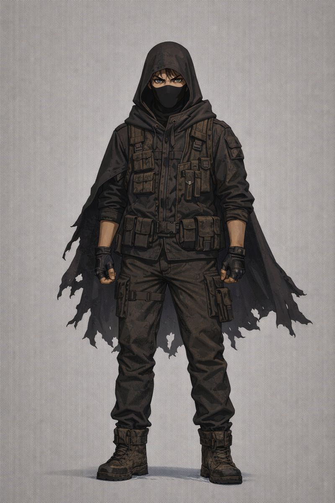

# Kade — Character Bio (Draft)

  
  

  
  
  

## Snapshot
Kade is a pragmatic, street-trained scavenger who survives by staying unreadable: hood up, mask on, eyes always scanning. Where others charge forward, Kade measures risk, maps exits, and makes sure the crew returns with something worth the danger. He speaks in short, controlled lines, but when he commits, he commits fully.

## Role in the Story
Kade functions as the crew’s **risk manager and field tactician**—the one who reads a room, predicts threats, and keeps the group from making loud mistakes in quiet places. He is the bridge between “we need resources” and “we need to live.”

## Appearance
- Typically seen in a **hoodie and mask**, built for anonymity and dust-filled corridors.
- Carries minimal gear outside, but inside scav sites his kit becomes precise: light, tools, cord, and a way out.
- When unmasked, his features mark him as **Hispanic**, with a calm intensity that contrasts the harsher look of his street gear.

## Background
Kade grew up learning what the Rings teach quickly: who gets watched, who gets hunted, and who gets erased. He didn’t inherit protection—he earned competence. Over time, scavenging became less about profit and more about leverage: the right salvage keeps you fed, keeps you free, and keeps the wrong people from owning you.

He is not sentimental about the city—but he is fiercely protective of the few people he trusts inside it.

## Core Skills
- **Stealth & Movement Discipline:** quiet footwork, controlled breathing, low-profile presence.
- **Threat Reading:** recognizes predatory patterns—human and otherwise—before they fully surface.
- **Scav Site Navigation:** understands tunnels, choke points, and “no-return” zones.
- **Salvage Triage:** quickly judges what is valuable, what is bait, and what will get them killed carrying it.
- **Crew Control Under Stress:** can de-escalate panic or cut through argument when seconds matter.

## Personality
- Controlled, observant, direct.
- Trust is earned through consistency, not promises.
- Humor exists, but it’s dry and usually timed to break tension—never to entertain.
- Kade doesn’t posture. If he speaks, it’s because it matters.

## Motivations
**Primary:** Stay free; keep the crew alive; build enough leverage to stop reacting to the city’s rules.  
**Secondary:** Prove that he can outthink the system that expects him to fail.  
**Private:** A quiet fear that if he ever relaxes, everything he’s built will collapse overnight.

## Strengths and Fault Lines
**Strengths**
- Calm under pressure.
- Loyal once bonded.
- Makes hard calls quickly and owns the outcome.

**Fault Lines**
- Over-controls when afraid.
- Keeps secrets “for the team,” which can become a betrayal if revealed late.
- Struggles with vulnerability—especially when someone tries to care about him openly.

## Relationships (Positioning)
- **Asher:** A functional counterbalance. If Asher is momentum, Kade is steering. Their tension can sharpen them—or split them—depending on trust.
- **The Crew:** Kade acts like he’s disposable, but he quietly tracks everyone’s patterns and weaknesses, compensating without announcing it.
- **Authority / Enforcers:** Kade treats power like weather: predictable, dangerous, and never negotiated with honestly.

## Narrative Hooks
- Kade discovers something in a salvage run that is **valuable enough to start a hunt**—and dangerous enough to fracture the group’s unity.
- He is forced to choose between **saving the crew** and **protecting a secret** that keeps them alive long-term.
- A figure from his past reappears with a deal that would solve everything—if Kade is willing to sell out one person.

## Quote (Tone Anchor)
“I’m not saying don’t do it. I’m saying decide what it costs before the dark decides for you.”

## Notes for Revision
- Confirm: Kade’s exact age range, origin ring (Outer / Second), and whether he has prior ties to enforcement, gangs, or a sanctioned trade.
- Confirm: what Kade refuses to do—even to survive (his personal line in the sand).
